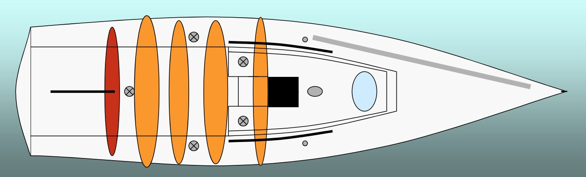
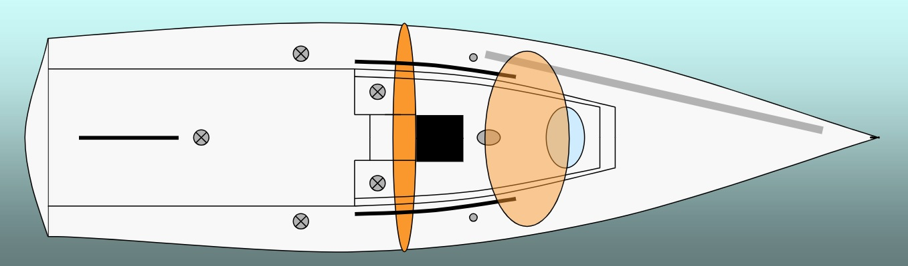

# Crew Positions/Roles

- [Helmsman](#helmsman)
- [Mainsheet](#mainsheet)
- [Trimmer](#trimmer)
- [Tailer](#tailer)
- [Bowman](#bowman)

## Work Zones

- Maintain optimal positioning in the zone
- Remain in your zone during manoeuvres
- While training do not help others in their tasks
- Focus on your own responsibility

---

# Helmsman

## Helmsman Responsibilities

- Steer
- Speed
- Timing
- Positioning of the boat
- Communication if boat should sail with reduced speed
- Backstay tension

## Helmsman Tips

- Maintain the best overview of the pre-start
- Control the speed precisely
- Think one step ahead

---

# Mainsheet

## Mainsheet Responsibilities

- Mainsail sheet
- Trim of the boat
- Cleaning up in downwind
- Windward spinnaker sheet in set
- Headsail halyard up in downwind
- Control roll turnings
- Communicate laylines
- Communicate opponent's speed, height and manoeuvres.
- Overhaul port side headsail sheet after first gybe

## Mainsheet Tips

- Trim the boat fast in the pre-start
- Be aware and communicate about wind power and wind jumps before the pre-start
- Communicate about the advantages of start marks
- Best mainsheet exchange
- Help the helmsman with tactics
- Trim main outhaul and cunningham in downwind if there is time

---

# Trimmer

## Trimmer Responsibilities

- Headsail trim
- Headsail trim in pre-start
- Help behind the tailer
- Sheet points
- Spinnaker trim
- Barber hauler trim
- Drop headsailsail halyard in the spinnaker set
- Remove headsail starboard sheet after spinnaker set

## Trimmer Tips

- Trim headsail in cooperation with mainsail trimmer
- Communicate about headsail (i.e., all in for close-hauled, or use %)
- Inform about wind changes, countdown
- Communicate power in the spinnaker
- Loft relievers so they are ready to be relaxed

---

# Tailer

## Tailer Responsibilities

- Tail headsail
- Spinnaker windward sheet
- Barber hauler
- Mainsail and headsail halyard
- Cunningham and kick
- Spinnaker pole up and down
- Spinnaker halyard
- Cleaning up in the cockpit
- Flying spinnaker pole
- Spinnaker drop
- Hold the boom out in downwind

## Tailer Tips

- Save your energy
- Explode in tailing
- Down on knees
- Drop the halyard in spinnaker drop, if panic drop help the bowman and return
  on tail, get ready for fast turnings and control the kick
- Clean up in the boat

---

# Bowman

## Bowman Responsibilities

- Foredeck
- Time keeping
- Y-flag in the protest
- Kick
- Spinnaker pole up and down
- Halyards on mast
- Spinnaker set
- Call headsail up in downwind
- Call spinnaker pole down

## Bowman Tips

- Sense of order on foredeck
- Orientation of the leeward mark on downwind
- Count down to pre-start and start for the helmsman
