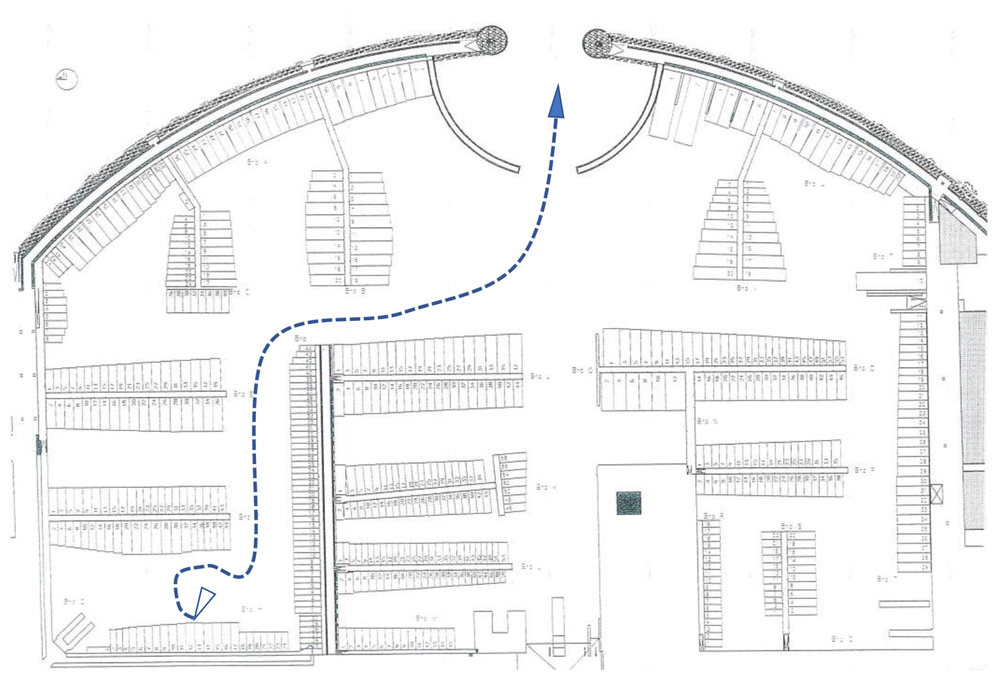
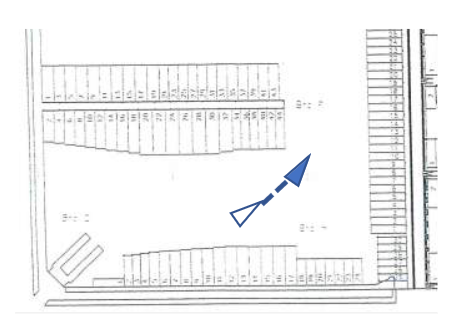
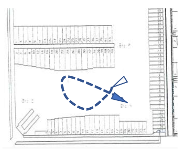
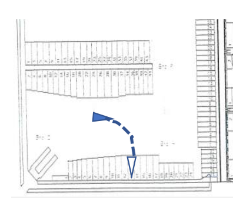
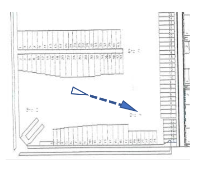
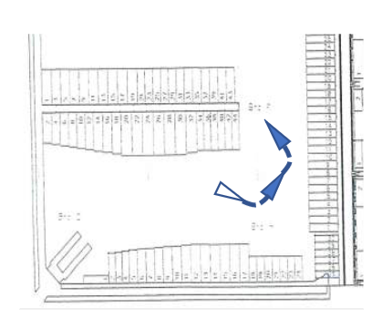

# Behavior in the harbour

- Keep focused!
- Give crew orders well ahead of manoeuvres.
- Beware of other boats, kayaks, poles, dinghies, ribs etc.
- Keep manoeuvre room to leeward - remember room for heeling.
- Don’t lose speed (complete tacks and gain speed before tacking).
- When you lack speed you will be drifting away from the wind.
- Control speed (reduce speed by going higher or over trimming sails).
- Use backing of headsail to force bow down when needed.

# Going Out (General Guidance)

- Choose between hoisting at a pole or letting go cowboy-style. Cowboy-style
  allows less time for stopping and explaining if any.
- In western winds, hoisting at pole or cowboy-style are both fairly simple.
- In eastern winds over 15 knots, going out is more tricky. Turning the boat
  can be very hard work and the cowboy-style needs a very good push to work.
- Main can only go up when pointing head-to-wind
- Headsail can go up any wind direction, but doing cowboy-style with the wind
  in front of you the boat must not be moving (too much) backwards when
  hoisting, because the sail will push it further backwards.
- When holding the boat with a line – always put the line around something
  solid: winch, pole, clamp...

## Hoisting sails at a pole (Westerly winds)

- Rig boat.
- Dedicate crew to moorings, halyards, mast and sheets.
- Explain manoeuver.
- Push boat slowly backwards, fix or hold one pole mooring in the front until
  ready.
- Hoist mainsail.
- Hoist headsail.
- Leave mooring on pole and push bow to one side.
- Bear away to the side you are pointing, trim sails and sail out.

## Hoisting sails at a pole (Easterly winds)

- Rig boat.
- Dedicate crew to moorings, halyards, mast and sheets.
- Explain manoeuvre.
- Back boat out of box, turn and go half way back in - now pointing east.

- Fix pole moorings on mast.
- Beware that jib or main sheets don’t catch poles.
- Hoist mainsail.
- Push the boat out with enough power to get a few meters clear of the box.

- Trim the main and bear away
- Hoist headsail and tack your way out.

## Hoisting cowboy-style (Southerly winds)

- Rig boat
- Dedicate crew to moorings, halyards, mast and sheets.
- Explain manoeuvre
- Push boat backwards with enough power to get to the other side of the basin
  (difficult when wind easterly > 15 knots, wait for a lull if the wind is
  gusty)
- When clear of the box; steer the aft to south

- Hoist headsail, trim and accumulate speed
- Tack and get speed
- If you lack speed make a roll by moving crew from leeward to windward
  simultaneously
- Head up and point at wind and hoist main

- Bear away and tack your way out

  

## Hoisting cowboy-style (Northerly winds)

- Rig boat.
- Dedicate crew to moorings, halyards, mast and sheets.
- Explain manoeuvre.
- Push boat backwards enough to get to the other side of the basin (difficult
  when wind easterly and > 15 knots, wait for a lull if the wind is gusty)
- When clear of the box; steer the aft to north.

- Hoist headsail, trim and accumulate speed.

- If you lack speed make a roll by moving crew from leeward to windward
  simultaneously.
- Head up and point at wind and hoist main.

- Bear away and tack your way out.

# Going In (General Guidance)

- All sails should be down before entering the box.
- Take sails down in time to bring down the speed so the boat stops without or
  just little help of moorings, pushing from the pier, etc.
- First take down the sail closest to the wind (in relation to the direction
  when approaching the box) – in middle and above middle winds that is done in
  the large eastern basin.
- The mainsail can only go down when pointing at the wind.
- The headsail can go down any wind direction, but it must land on the deck.
- Go into the box on a course perpendicular to the pier, it might be useful to
  take a sharp 90° turn onto this course to reduce speed.
- If you need to stop boat with the moorings - put the line around a winch.

## Going In (Westerly winds)

- Outside harbour: run through halyards, dedicate crew to mast, halyards and
  sheets, inform crew about maneuver.
- Drop the headsail in the large basin if very windy, otherwise wait until the
  canal.
- Tack your way in the canal.
- Drop the main pointing to the wind with just enough speed remaining to enter
  the box. Take into account that the wind is against you.

## Going In (Easterly winds)

- Outside harbour: run through halyards, have sail ties ready for main,
  dedicate crew to mast, halyards and sheets, inform crew about manoeuvre
- In the large basin head up and drop the main when pointing at the wind
- Bear away and keep headsail trimmed
- Drop the headsail with just enough speed remaining to enter the box. Take
  into account the the wind will push you even without sails
