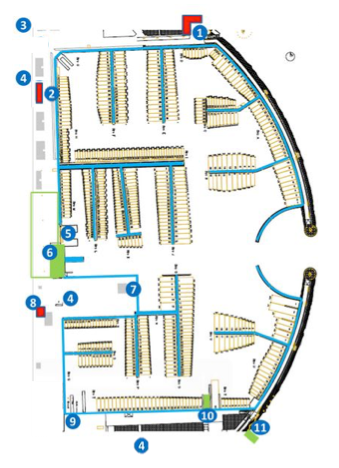

# Skovshoved Harbour

## Medical

### 1. First-aid kit

### 2. First-aid kit

### 8. Heart starter (AED) - in harbourmaster's office on the corner

## Facilities

1. Restaurant & Club room
2. KDY clubhouse (Basen)
3. Service station & Ice-cream shop
4. Public parking
5. Dinghy trolley park
6. Access ramp (Dinghy)
7. Refuelling jetty
8. KDY/SKS shared youth sailing clubhouse
9. Sailing equipment shop (Nordbjærgs)
10. Access ramp (Speed boats)
11. Guest ramp & jetty (Fair weather pick up)
